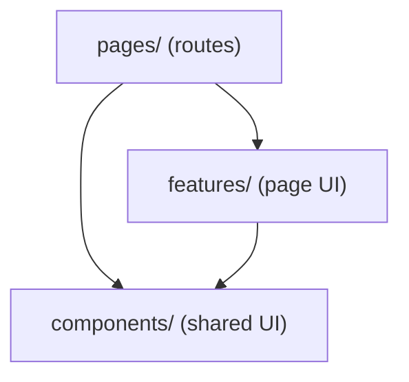

# Architecture

```mermaid
graph TD
  pages["pages/ (routes)"]
  features["features/ (page UI)"]
  components["components/ (shared UI)"]

  pages --> features
  pages --> components
  features --> components
```

## 폴더 파일 구성

각 폴더: `index.ts` · `Component.tsx` · `.style.ts` · `.type.ts`
